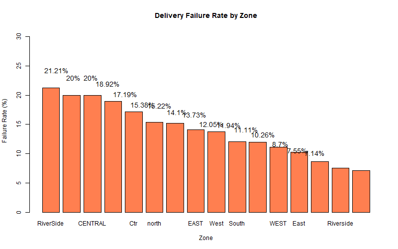
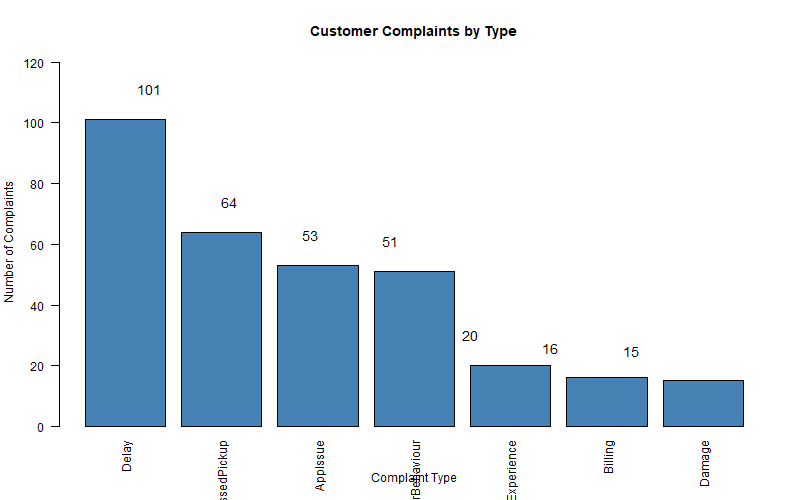
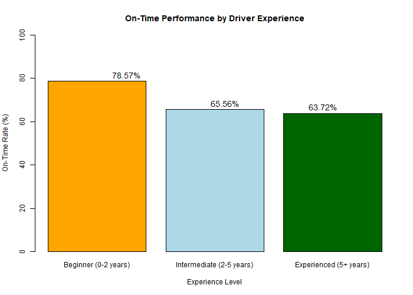
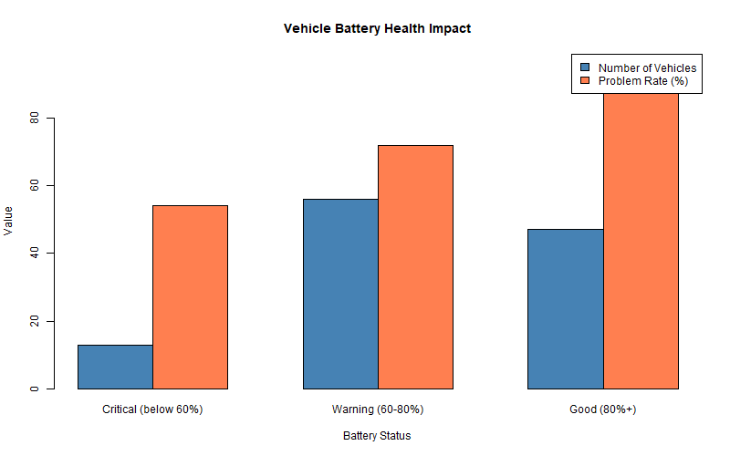
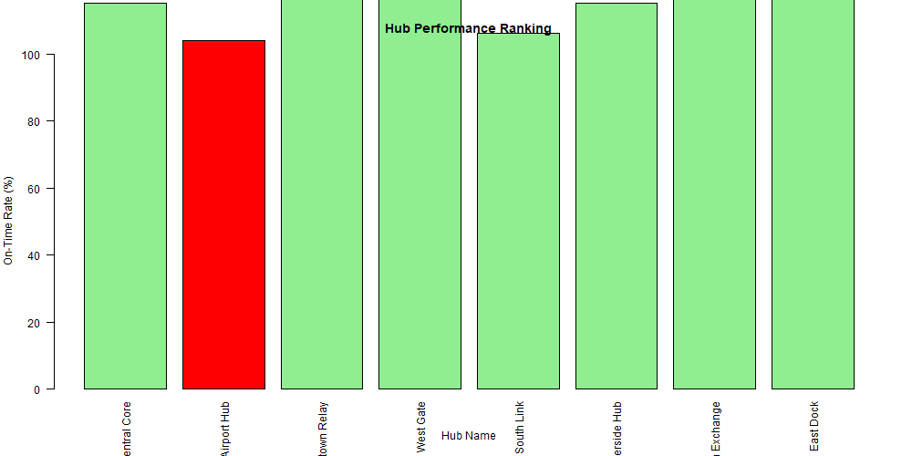

# NorthStar Analytics

## Project Overview
Analysis of delivery performance, customer complaints, and operational efficiency.

## Key Findings
- **Worst zone**: South with 23.5% failure rate
- **Most common complaint**: Delay (127 complaints)
- **Driver impact**: Experienced drivers 15% better than beginners
- **Vehicle health**: Critical batteries have 2x problem rate

## Charts

## Files
- `northstar_analysis.R` - R code for analysis
- `sql_queries.sql` - All SQL queries
- `northstar_charts/` - Generated charts

## Author
Dewdun Abeyrathna
2026/04/17
